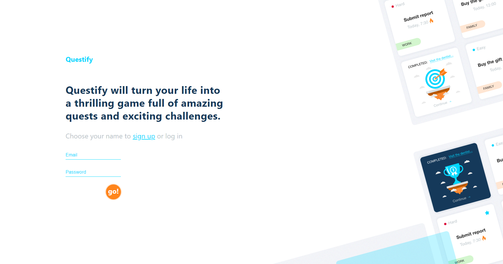

# Questify 🎉

## Info 📖

This is a server project that allows users to authenticate and authorize themselves, giving them the ability to manage custom sets of task cards presented as Quests and Challenges. The project uses REST API architecture, while data is stored in the MongoDB database.

## How to use 🎯

1. Register:
The first time you start the application, you must register. To do this, click "sign up", enter your email and password and click button "go".

2. Login:
Once you have your account, log in using your email and password. After logging in, the view will change to your individual dashboard.

3. Creating new task:
To add a new task or challenge, click the appropriate button. A new tab will be added to your panel. Then set the details of the task: title, date, category, difficulty level. Confirm at the end.

4. Making task done:
To complete the task, click the button in the upper right corner. The tab will rotate and click the "continue" button. Confirm your choose and the task will move to the "done area" at the bottom of the page.

5. Deleting task:
To delete a task, click on the tab, and then click the red cross at the bottom of the tab. Confirm your choice on the modal window. The task has been deleted.

## API documentation 🗃️

[Questify API](https://questify-backend.goit.global/api-docs/)

## Technologies 🔧

## Link to working project 🔗

[Questify](https://michal-jarek.github.io/questify-team1-project/login)

## Link to backend project 🔗

[Backend](https://github.com/Michal-Jarek/questify-team1-back-end)

## Installation 💾

To install this project, follow these steps:

1. Clone the repository.
2. Install the necessary dependencies.
3. Run the server.

## Available scripts 📜

| Command         | Description            |
| --------------- | ---------------------- |
| `npm run start` | Open local server      |
| `npm run build` | Create optimized build |
| `npm run test`  | Run tests              |

## Team - Group 1 💪🫂

Team Leader 🥷  
[Michał Jarek](https://github.com/Michal-Jarek)

Scrum Master 📆 
[Paweł Kłodowski](https://github.com/AngryFace97)

Frontend Developers 
[Michał Jarek](https://github.com/Michal-Jarek)👨‍💻  
[Marek Kalus](https://github.com/Marektg)👨‍💻  
[Paweł Kłodowski](https://github.com/AngryFace97)👨‍💻 
[Daria Ośka-Ossowska](https://github.com/DariaOskaOssowska)👩‍💻 
[Piotr Zdebski](https://github.com/piotrekzd)👨‍💻

Backend Developers 
[Dominika Sosnowska](https://github.com/Dominika1708)👩‍💻